# Simulador de Gerência de Memória: LRU vs. Segunda Chance (Clock)

Este projeto consiste em um **Simulador de Gerência de Memória** focado em paginação, desenvolvido como parte da disciplina de Sistemas Operacionais. O objetivo principal é simular, analisar e comparar o comportamento e a eficiência de dois importantes algoritmos de substituição de página: **LRU (Least Recently Used)** e **Segunda Chance (Clock)**, ambos operando em um ambiente com **3 frames de memória física**.

O simulador monitora o status de cada acesso à memória, registrando *Page Hits* e *Page Faults*, além de exibir visualmente a evolução dos frames da memória RAM a cada passo da execução.

---

##  Funcionalidades do Simulador

O sistema implementa os seguintes métodos fundamentais para ambos os algoritmos:

1. **Acesso de Página:** Varre a memória para verificar a presença da página solicitada.
2. **Substituição de Página:** Determina de forma inteligente qual página será removida (vítima) quando a memória estiver cheia e ocorrer um *Page Fault*.
3. **Impressão do Mapa de Memória:** Exibição detalhada no terminal do status atualizado passo a passo, facilitando a interpretação das entradas e saídas.

---

##  Algoritmos Implementados

### 1. LRU (Least Recently Used)
O algoritmo **LRU** baseia-se no princípio da localidade temporal, substituindo a página que está há mais tempo sem ser acessada na memória RAM.
* **Acessar Página LRU:** Percorre os frames verificando se a página solicitada já está carregada. Se ocorrer um *Hit*, renova o indicador de último acesso. Se ocorrer um *Fault*, remove o registro com o acesso mais antigo e insere o novo item com o tempo de acesso atual.
* **Substituir Página LRU:** Compara o valor de `ultimoAcesso` de cada frame. O frame com o menor valor (acessado há mais tempo) é escolhido como vítima. A nova página é carregada e o atributo de tempo é atualizado.
* **Imprimir Mapa de Memória LRU:** Exibe o status do acesso (*Hit* ou *Page Fault*), o conteúdo atual de cada frame (`Página X` ou `[vazio]`) e sinaliza com um indicador (`<-- Alterado`) o frame que sofreu modificações naquele ciclo. Ao final, apresenta estatísticas consolidadas (total de acessos, faltas e taxa percentual).

### 2. Segunda Chance (Clock)
O algoritmo **Segunda Chance** utiliza a estrutura de uma **fila circular** (ou relógio) combinada com um bit de referência para otimizar a substituição.
* Quando ocorre um *Page Fault*, o ponteiro percorre a fila circular avaliando o bit de acesso da página.
* Se a página avaliada tiver acessos recentes (bit = 1), o algoritmo concede uma "segunda chance": zera o seu bit e avança para o próximo elemento.
* Se a página tiver bit = 0, ela é escolhida para ser substituída na memória RAM pelo novo arquivo solicitado.

---

## 📊 Casos de Teste e Comparação Visual

O projeto inclui cenários de teste projetados para ilustrar o comportamento prático de cada método. A execução dos testes permite uma comparação direta e visual das taxas de *page fault* geradas por cada algoritmo sob a mesma sequência exata de acessos de memória, evidenciando as vantagens estruturais e os limites de cada abordagem.

---

## 🛠️ Estrutura do Código

Os principais módulos e estruturas lógicas do simulador incluem:
* **Representação dos Frames:** Estrutura de dados que mapeia os 3 slots da memória RAM física.
* **Controle de Estatísticas:** Contadores e funções para cálculo de métricas de desempenho.
* **Loop de Execução:** Interpretador de sequências de entrada que processa a fila de requisições sequencialmente.

---

## _Resultados com_ _**LRU** :_ 

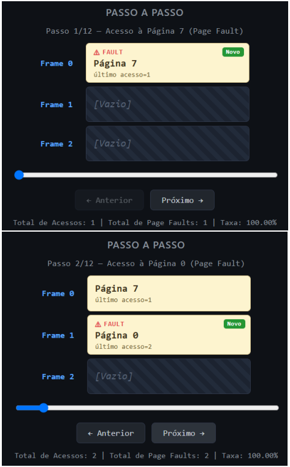
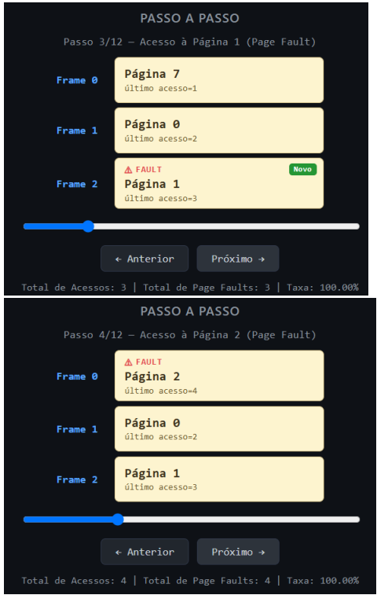
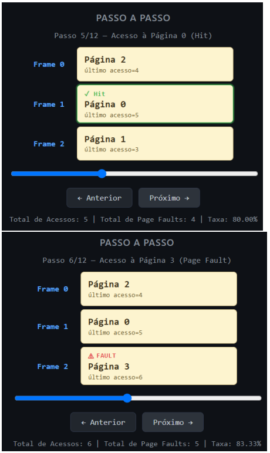
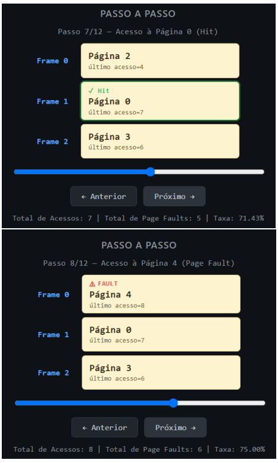
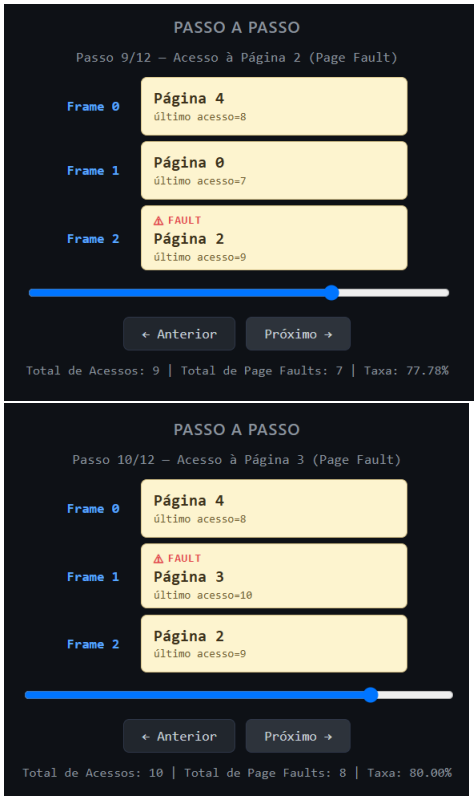
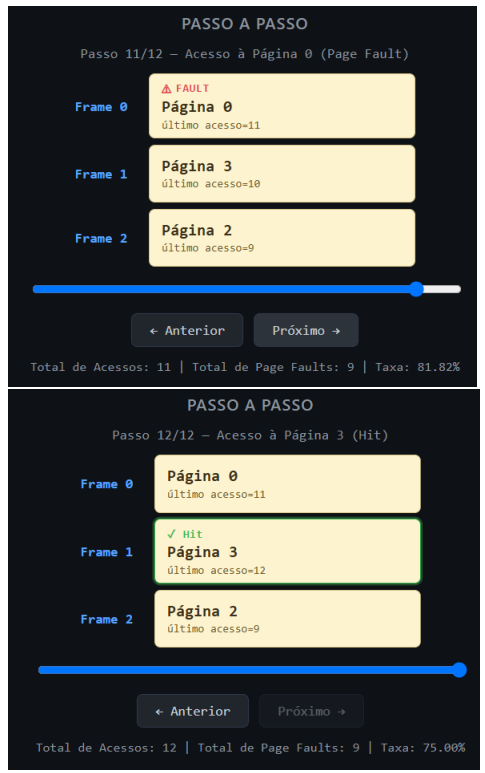

## _Resultados com_ _**Second Chance** :_ 

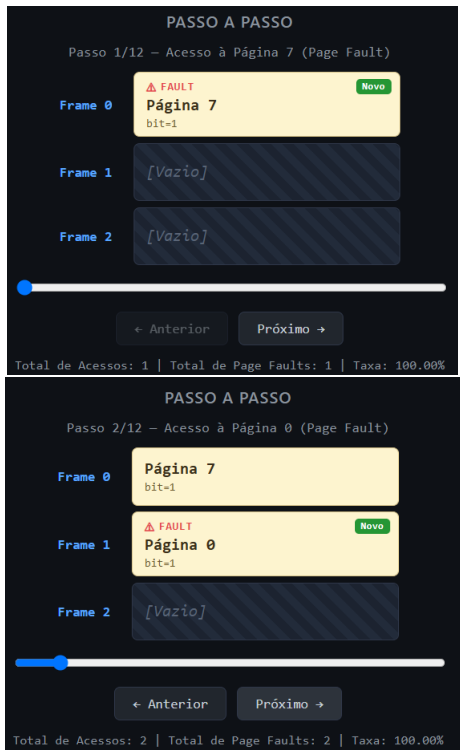
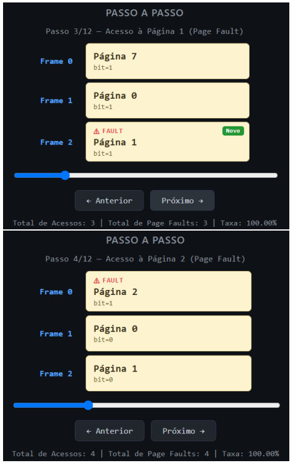
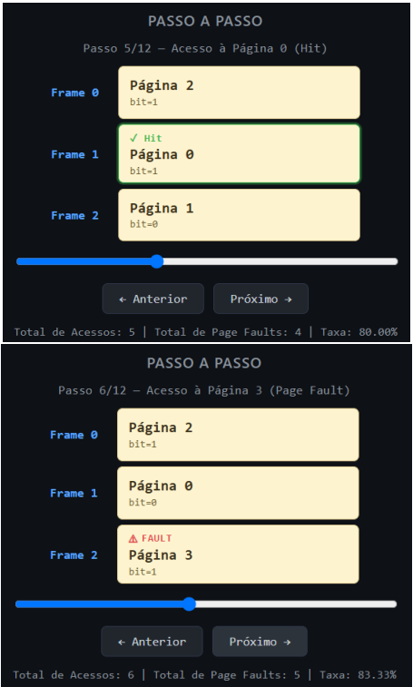
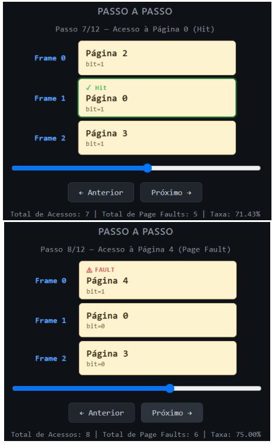
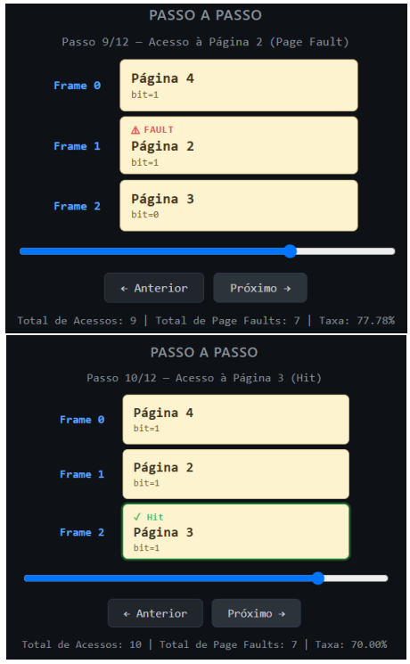
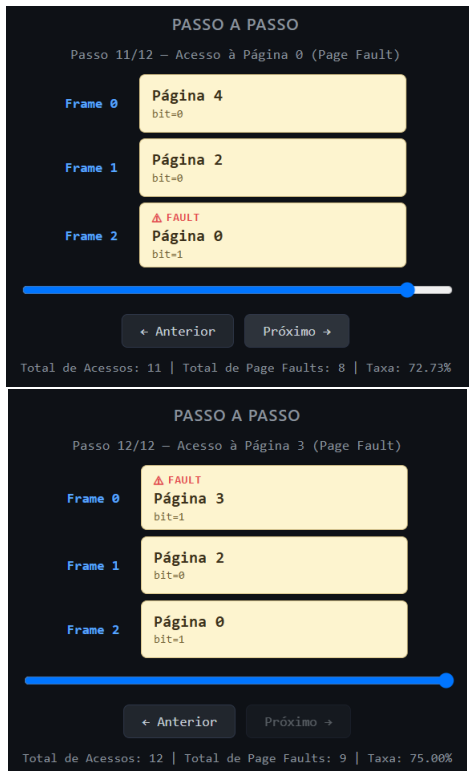

---

## **REFERÊNCIAS** 

• Repositório fonte do projeto Disponível em: https://github.com/ProfessorFilipo/MemSim/tree/main 
• Repositório criado pelo grupo Disponível em: https://github.com/KillianDB/MemSis 
• Operating System Concepts - Abraham Silberchatz, 9ª edição. 
